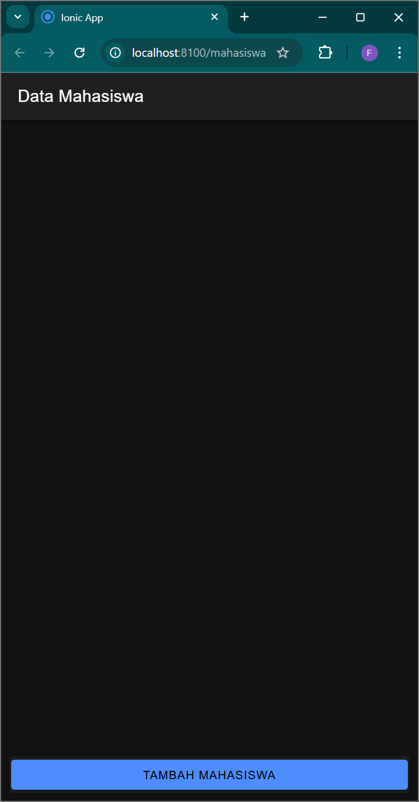
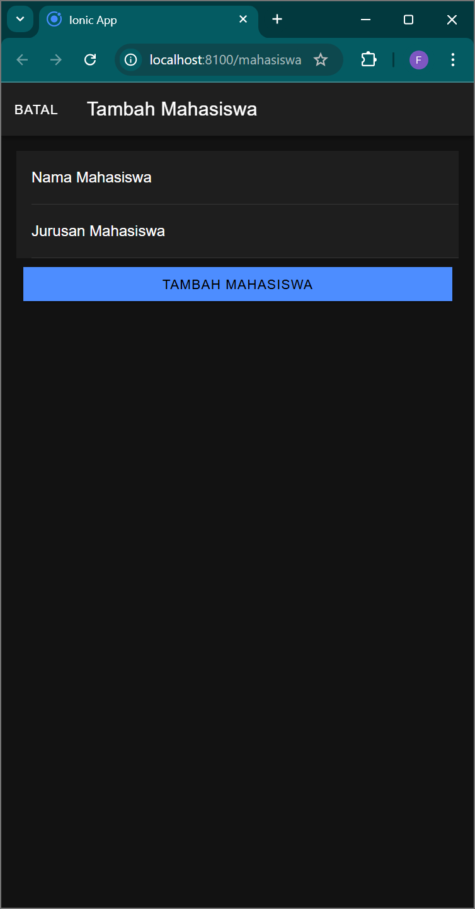
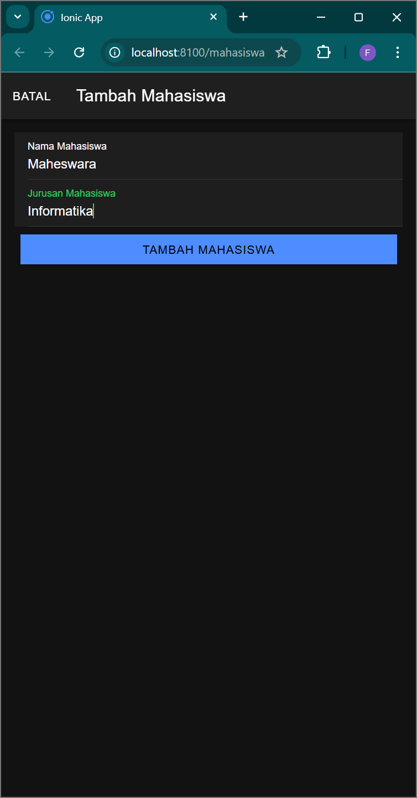
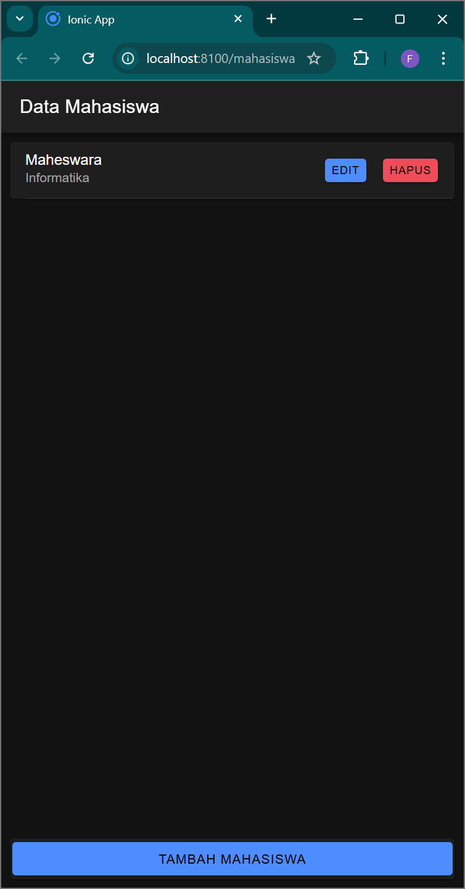
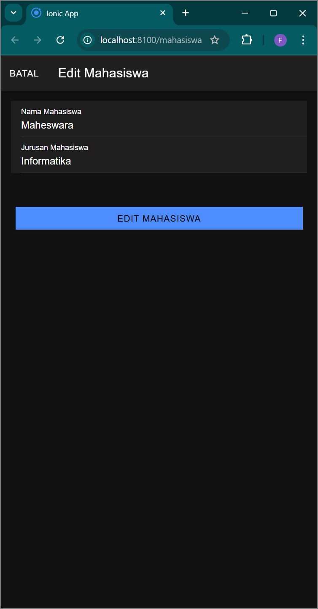
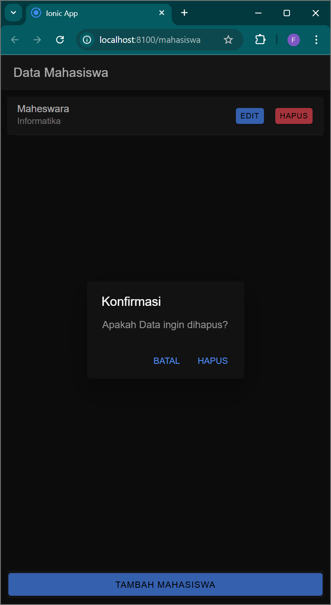

# LabMobile8_Fadhila-Galih-Maheswara_Shift-D
 
Nama        : Fadhila Galih Maheswara
Nim         : H1D022007
Shift Lama  : D  
Shift Baru  : D

# Proses Manajemen Data Mahasiswa

Program aplikasi ini dirancang untuk mempermudah pengguna dalam melakukan pengelolaan terhadap data mahasiswa. Berikut adalah penjelasan terkait dengan fitur-fitur yang tersedia.

## 1. Menambah Mahasiswa
Untuk menambahkan data mahasiswa baru, pengguna dapat membuka modal tambah dengan memanggil fungsi `openModalTambah()`. Setelah modal terbuka, pengguna akan diminta untuk mengisi nama dan jurusan mahasiswa. Setelah semua informasi diisi, pengguna cukup menekan tombol untuk menambah mahasiswa. Fungsi `tambahMahasiswa()` akan mengirimkan data tersebut ke server menggunakan metode POST dan menyimpannya dalam database. Dengan cara ini, pengguna dapat dengan mudah menambah mahasiswa baru ke dalam sistem.

## 2. Mengedit Mahasiswa
Jika pengguna ingin mengubah informasi mahasiswa yang sudah ada, mereka dapat membuka modal edit dengan menggunakan fungsi `openModalEdit()`. Fungsi ini akan mengambil data mahasiswa berdasarkan ID yang diberikan dan menampilkannya di modal. Setelah pengguna melakukan perubahan yang diperlukan, mereka dapat menekan tombol untuk menyimpan perubahan. Fungsi `editMahasiswa()` akan mengirimkan data yang telah diperbarui ke server, sehingga informasi mahasiswa akan selalu terupdate.

## 3. Melihat Mahasiswa
Data mahasiswa ditampilkan dalam bentuk daftar yang diambil dari server menggunakan fungsi `getMahasiswa()`. Fungsi ini akan memanggil API untuk mendapatkan semua data mahasiswa dan menyimpannya dalam variabel `dataMahasiswa`. Dengan cara ini, pengguna dapat dengan mudah melihat semua informasi mahasiswa yang terdaftar dalam sistem.

## 4. Menghapus Mahasiswa
Jika pengguna ingin menghapus data mahasiswa, mereka dapat menekan tombol hapus yang akan memanggil fungsi `hapusMahasiswa()`. Sebelum menghapus, aplikasi akan menampilkan konfirmasi untuk memastikan bahwa pengguna benar-benar ingin menghapus data tersebut. Jika pengguna mengonfirmasi, fungsi ini akan mengirimkan permintaan ke server untuk menghapus data mahasiswa berdasarkan ID yang diberikan. Dengan langkah ini, pengguna dapat mengelola data mahasiswa dengan lebih aman.

## 5. Mengambil Data Mahasiswa
Method `ambilMahasiswa(id: any)` digunakan untuk mengambil data mahasiswa berdasarkan ID yang diberikan. Berikut adalah langkah-langkah yang dilakukan:
- **Memanggil API**: Method ini memanggil API menggunakan service `ApiService` untuk mendapatkan informasi mahasiswa yang sesuai dengan ID.
- **Menangani Respons**: Jika berhasil, data mahasiswa akan disimpan dalam variabel dan ditampilkan di modal edit. Jika gagal, pesan kesalahan akan ditampilkan di konsol.
- **Pentingnya Method**: Method ini sangat penting dalam proses pengeditan, karena memastikan bahwa pengguna dapat melihat dan mengedit informasi yang tepat sebelum menyimpannya kembali ke database.

# Screenshot

  
  
  
  
  
  

